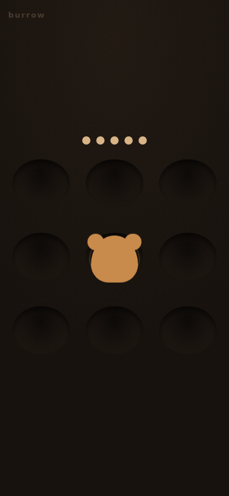
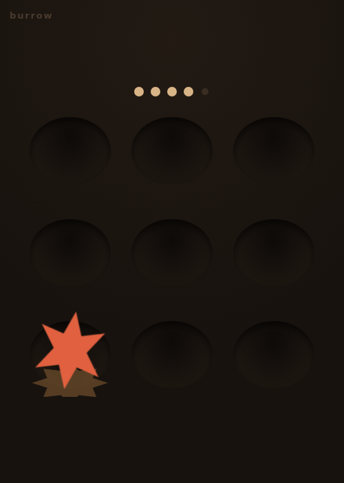

# Process overview

## What I built

**Burrow**: whack-a-mole in nine holes, with no words anywhere. A mole that
retreats unhit costs a life; striking a decoy — same colour and size, spiked
rather than domed — costs one too. Those pressures pull against each other. It
opens on one mole already up, which is both the invitation and the start button,
and the decoy rule is taught only by losing exactly one life to it.

## The moments that mattered

### 1. I had an agent refute my own difficulty design

I had planned for late waves to get harder by raising the decoy ratio. Rather
than build on that, I had an independent agent attack the arithmetic. Hazard
*falls* monotonically in the ratio — ignoring a decoy is free, so more decoys
means less work — and the distinct silhouette I chose for colourblind safety is
exactly what guarantees it. My two decisions were mutually exclusive. It also
caught that my widened onset gap had left zero overlap at wave 6, disabling the
concurrency lever too. Both now sit in the suite as assertions.

> Be adversarial about the arithmetic — I specifically want you to refute my claim.

[`b90650c`](https://github.com/comp4020-agentic-coding-studio/comp4020-crit5-Gera1t-2001/commit/b90650c)

### 2. The focused test passed first time, so I broke it

Passing on the first attempt is the shape of a false green. My `CLAUDE.md` rule
is that a green needs proof the sensor answers a *deliberate* change, so I broke
the decoy rule both ways — dropped the idempotency filter, then charged two
lives. Each reddened exactly the assertions naming that failure and no others,
which is what shows the tests are focused rather than coupled.

[`10a8433`](https://github.com/comp4020-agentic-coding-studio/comp4020-crit5-Gera1t-2001/commit/10a8433)

### 3. Forty-one green tests over a visibly broken interface

`pnpm check` was fully green while every target rendered half a body-width right
of its own hole. Three rules were writing the same box; rather than find which
won, I removed the interaction. Then I verified by reading
`getBoundingClientRect` over CDP instead of by looking — 95×95 CSS px at
390×844, against a 60px floor.

[`96ad39d`](https://github.com/comp4020-agentic-coding-studio/comp4020-crit5-Gera1t-2001/commit/96ad39d)
